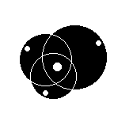
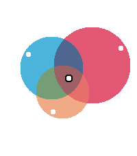

# Pebble-BigVenn


A watchface for the Pebble Smartwatch.

Who needs numbers when you can use color and circles?  This colorful (in certain
platforms :-)) watchface uses three rotating circles to show you the hour,
minute and (optionally) seconds.

And of course you can customize the color of each circle!

This watchface was made for the
[Rebble Hackathon #002](https://rebble.io/hackathon-002/).

## Screenshots

| Aplite                                | Basalt                                | Chalk                               | Diorite                                 | Emery                               |
| ------------------------------------- | ------------------------------------- | ----------------------------------- | --------------------------------------- | ----------------------------------- |
|  |  |  |  |  |

## Installing

[Get it from the Rebble Store](https://apps.rebble.io/en_US/application/67c39775d2acb30009a3c7ac).

## Dependencies

* Pebble SDK
* pebble-clay

## Building & Installing from Source

```
pebble build
pebble install --phone [PHONE_IP_ADDRESS]
```

## Acknowledgements

This watchface was inspired by Mr Jones Watches'
[Colour Venn](https://mrjoneswatches.com/collections/all-watches/products/colour-venn)
watch.

## License

Copyright (C) 2025  Javier Rizzo-Aguirre

This program is free software: you can redistribute it and/or modify
it under the terms of the GNU General Public License as published by
the Free Software Foundation, either version 3 of the License, or
(at your option) any later version.

This program is distributed in the hope that it will be useful,
but WITHOUT ANY WARRANTY; without even the implied warranty of
MERCHANTABILITY or FITNESS FOR A PARTICULAR PURPOSE.  See the
GNU General Public License for more details.

You should have received a copy of the GNU General Public License
along with this program.  If not, see <https://www.gnu.org/licenses/>.
